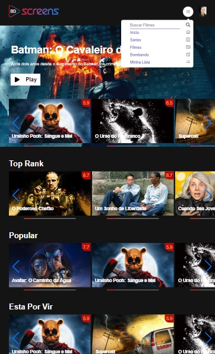
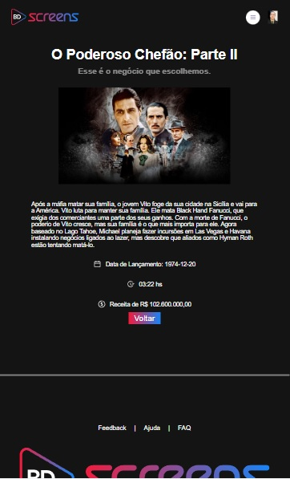
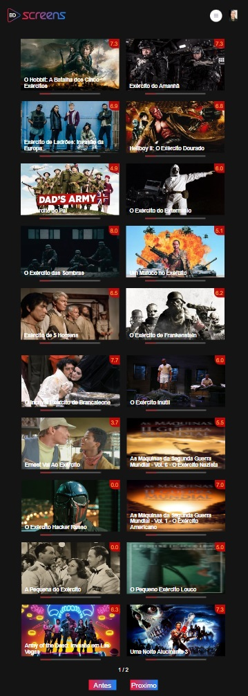

  

# SCREENS MOVIES

Mais um projeto para nunca ficar parado. Nesse projeto peguei dois design no site FIGMA para ter referência e ter uma base pois ainda so bom de Front-end e não de criação heheh.
Nesse projeto pratiquei conexões com API, estilização com carousel, a nova API do React Router Dom, criei condicionais para renderização caso houvesse ou nao imagens para o banner, criei a reponsividade adaptando o layout que havia apenas para o tamanho desktop.
Ainda pretendo melhorar mais algumas navegações.

## Screenshots

  

  

  

## Funcionalidades

- Página personalizada de busca
- Paginação com contador de página atual e total de página
- Reponsividade com adaptação para varias telas
- Atualização real de acordo com a API do TheMovies

## 🛠 Habilidades

React/Vite, Style Components, Axios, Javascript, HTML, CSS...

## Tecnologias

Tecnologias e ferramentas utilizadas no desenvolvimento do projeto:

- [React](https://reactjs.org/)
- [TypeScript](https://www.typescriptlang.org/)
- [Styled Components](https://styled-components.com/)
- [Axios](https://github.com/axios/axios)
- [Vite](https://vitejs.dev/)
- [Radix-ui](https://www.radix-ui.com/)
- [Swiper](https://swiperjs.com/)

##API

- [TheMovieDB](https://developers.themoviedb.org/3/getting-started/introduction) Uma API publica que fornece um enorme DB de filmes atualizada constantemente por seus usuários

## Intalação

### Abra um terminal e copie este repositório com o comando

git clone https://github.com/3ddybr/screens_movies.git

### ou use a opção de download.

### Entre na pasta web com

cd screens_movies

### Instale as dependências

yarn install

### Rode a aplicação

yarn start
